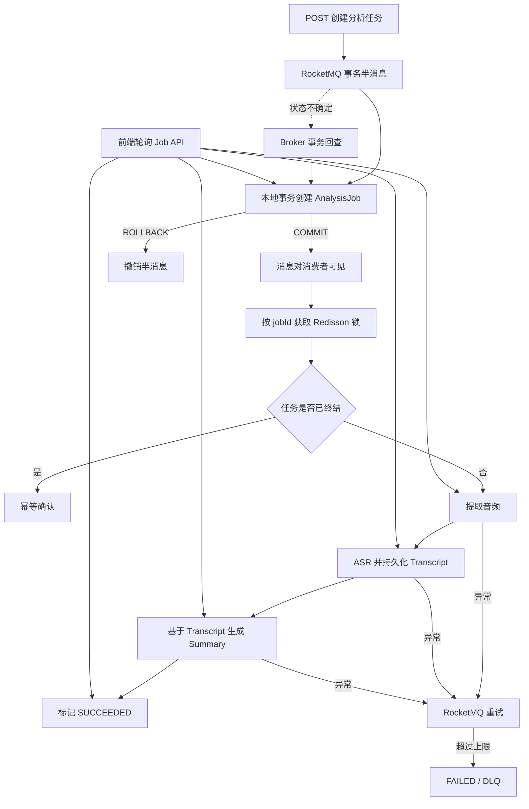

# VedioMind

面向长视频的 AI 内容理解平台。用户可以上传本地视频或导入网络视频，系统在后台完成音频提取、语音转写和内容总结，并在前端展示可恢复的任务进度。

> 当前重点是项目演示与异步架构闭环。鉴权、私有对象访问和生产级 URL 导入安全仍在 Roadmap 中，不建议直接部署到公网。

## 核心能力

- 本地视频上传到 MinIO，或通过 yt-dlp 导入网络视频。
- FFmpeg 提取音频，SiliconFlow 完成 ASR，DeepSeek 基于 Transcript 生成总结。
- RocketMQ 事务消息保证“任务落库”和“消息投递”不会只成功一边。
- 独立 `AnalysisJob` 状态机记录阶段、进度、重试次数和失败原因。
- 消费失败由 RocketMQ 重试；达到上限后标记 `FAILED` 并进入死信流程。
- Redisson Job 锁与数据库终态检查共同处理重复投递和并发消费。
- Transcript 在 ASR 完成后立即持久化，重试不会重复执行已经成功的昂贵阶段。
- 前端按 `jobId` 轮询结构化状态，刷新页面后仍可恢复当前任务。
- Flyway 管理数据库结构，新环境无需手工建表。

## 异步分析链路



任务状态流转：

```text
QUEUED
  → EXTRACTING_AUDIO
  → TRANSCRIBING
  → SUMMARIZING
  → SUCCEEDED

任一处理阶段异常 → RETRYING → 下一次消费
超过重试上限     → FAILED
```

这里选择 RocketMQ 事务消息而不是额外引入 Outbox：项目已经依赖 RocketMQ，事务消息能够以更少的组件完成当前所需的“本地任务记录 + MQ 投递”一致性。消费者侧的幂等、状态恢复和重试仍由 `AnalysisJob`、Redisson 与 RocketMQ 共同完成。

## 技术栈

| 层次 | 技术 |
| --- | --- |
| 前端 | Vue 3、Vite、Marked |
| 后端 | Java 21、Spring Boot 3、MyBatis-Plus、Undertow |
| 异步任务 | RocketMQ 4.9.4、Redisson |
| 数据 | MySQL 8、Redis、Flyway |
| 对象存储 | MinIO |
| 媒体处理 | FFmpeg、yt-dlp |
| AI | SiliconFlow ASR、DeepSeek |

## 主要接口

| 方法 | 路径 | 用途 |
| --- | --- | --- |
| `POST` | `/media/upload` | 上传本地视频 |
| `POST` | `/media/upload-url` | 导入网络视频 |
| `GET` | `/media/list` | 查询当前用户媒体列表 |
| `POST` | `/analysis/media/{mediaId}` | 创建或返回该媒体正在执行的分析任务 |
| `GET` | `/analysis/jobs/{jobId}` | 查询任务状态与进度 |
| `GET` | `/debug/transcribe?id={mediaId}` | 单独触发文字提取（开发接口） |
| `GET` | `/debug/download?id={mediaId}` | 转码并下载音频（开发接口） |

分析任务提交成功返回 HTTP `202 Accepted`，响应示例：

```json
{
  "id": "84473eac-7f71-4307-a11c-d3ebd7654cef",
  "mediaId": 42,
  "status": "QUEUED",
  "progress": 0,
  "retryCount": 0,
  "errorMessage": null,
  "createdAt": "2026-09-28T14:30:00",
  "startedAt": null,
  "finishedAt": null
}
```

## 本地运行

### 1. 环境要求

- JDK 21
- Node.js 22（Vite 最低要求为 20.19）
- Docker 与 Docker Compose
- FFmpeg
- yt-dlp

### 2. 启动中间件

```bash
docker compose up -d
```

默认会启动 MySQL、Redis、MinIO、RocketMQ NameServer、Broker 和 Dashboard。端口见 [docker-compose.yml](docker-compose.yml)。

### 3. 配置后端

```bash
cp server/src/main/resources/application.example.properties \
   server/src/main/resources/application.properties

export DEEPSEEK_API_KEY=your_deepseek_key
export SILICONFLOW_API_KEY=your_siliconflow_key
export FFMPEG_DIR=/path/to/ffmpeg/bin
export YTDLP_PATH=/path/to/yt-dlp
```

数据库连接、MinIO、Redis 和 RocketMQ 均提供了适配本仓库 Docker Compose 的默认值。真实密钥只应放在环境变量或被 Git 忽略的本地配置中。

### 4. 启动后端

```bash
cd server
./mvnw spring-boot:run
```

后端默认监听 `http://localhost:9090`。首次启动时 Flyway 会创建所需表；对于已有但尚未由 Flyway 管理的数据库，会从基线版本 `0` 接管。

### 5. 启动前端

```bash
cd client
npm install
npm run dev
```

前端默认访问 `http://localhost:5173`。

## 验证

```bash
cd server
./mvnw test

cd ../client
npm run build
```

测试覆盖事务消息提交/回查、消费重试与失败终态，以及“仅执行一次 ASR、基于已保存 Transcript 生成总结”的主流程。

## Roadmap

- Spring Security、密码哈希、资源所有权校验与统一错误响应。
- 私有 MinIO Bucket 与短时效预签名访问 URL。
- MinIO Multipart 直传、断点续传和真实上传进度。
- URL 白名单、SSRF 防护、下载大小/时长限制和外部进程治理。
- 带时间戳的字幕 Segment、章节导航和播放器联动。
- 基于字幕引用的视频问答，以及 OCR、关键帧和多模态理解。
- 任务错误码、模型/Prompt 版本、耗时、Token 与成本统计。
