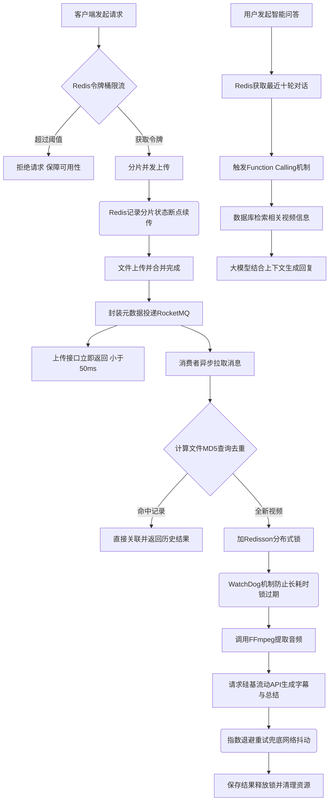

# ViedoMind - 智能视频内容理解平台

**全链路异步化 / 长任务稳定性保障 / AI 智能问答**


  


  


**VedioMind** 是一个集成用户鉴权、视频上传、音频提取及 AI 自动总结的全链路视频内容理解平台。

针对视频处理场景中常见的 **“长耗时阻塞”** 、 **“高并发资源冲突”** 以及 **“大文件传输不稳定”** 等痛点，本项目抛弃了传统的同步处理模式，基于 **RocketMQ + Redisson + 分片续传** 重构了系统架构。

系统可以接入大模型api，自定义提示词，基于 Function Calling 可以实现查询信息和精准总结。

视频平台大多只解决了“存储”和“播放”的问题。DoVideoAI 旨在解决“理解”的问题。 它通过异步架构处理长耗时任务，利用 AI 提取核心价值，让视频不再是黑盒。

  


## 项目预览

项目简览


L4J

  


## 核心功能

1. 🚀 稳定上传体验

分片断点续传：针对 GB 级大文件（如 4K 课程录像），采用 Redis 维护上传分片状态。实测在 20% 丢包率弱网环境下，上传成功率从 25% 提升至 99%。

秒级响应：引入 RocketMQ 将耗时的“视频分析”动作剥离出主线程。用户上传完成后仅需 50ms 即可得到反馈，后续处理全异步化，彻底告别页面转圈卡死。

1. 🛡️ 高并发防护

分布式锁兜底：使用 Redisson + WatchDog 机制。当多个用户同时上传同一个热门公开课视频时，系统通过 MD5 内容指纹识别，利用分布式锁防止重复转码与 AI 分析，节省算力与 Token 开销。

削峰填谷：Controller 层集成 Redis 令牌桶算法，有效遏制恶意请求与突发流量，保护后端服务不被击穿。

1. 🔄 任务处理流程详解

稳健入口：文件直传 MinIO，避免应用服务器带宽瓶颈。

异步解耦：上传成功后，Controller 仅发送一条消息至 RocketMQ 即刻返回，将长耗时任务留给后台。

安全消费：消费者通过 Redisson 锁住视频 MD5，确保同一视频在同一时刻只有一个线程在处理。

智能重试：针对第三方 AI API 可能的网络抖动，设计了指数退避重试机制，确保任务最终一致性。

  


## 技术栈


### 后端

SpringBoot + RocketMQ + Redis + MySQL + MyBatis Plus + MinIO + FFmpeg

### 部署

Docker 

### 前端

Vue 3 + Vite 

  
不严谨流程图




  


## 我的开发环境


| 组件              | 版本           | 备注                                |
| --------------- | ------------ | --------------------------------- |
| **JDK**         | 21.0.8       | 支持 Spring Boot 3 即可               |
| **Node**        | v22.18.0     | 前端构建依赖                            |
| **MySQL**       | 8.0          | Docker 镜像 `mysql:8.0`             |
| **Redis**       | Latest (7.x) | Docker 镜像 `redis:latest`          |
| **RocketMQ**    | 4.9.4        | Docker 镜像 `apache/rocketmq:4.9.4` |
| **LangChain4j** | DeepSeek     | 硅基流动送14元免费额度                      |
| **FFmpeg**      | Latest       | 推荐 2025 年后的 Snapshot 版本           |
| **yt-dlp**      | Latest       | 建议定期 `update` 保持解析库最新             |


  


## 如何本地部署


### 中间件部署 (Docker Compose)

本项目依赖多个中间件封装为 Docker Compose 文件。

```bash
# 在项目的根目录下，直接一键启动所有服务
# (包含 MySQL, Redis, MinIO, RocketMQ, Dashboard)
docker-compose up -d
```


### 后端配置修改

真实配置文件包含本地路径和 API Key，不会提交到 Git。首次启动时复制示例配置：

```bash
cp server/src/main/resources/application.example.properties \
   server/src/main/resources/application.properties
```

然后优先通过环境变量填写本地配置：

#### 1. 配置数据库密码

确保与 docker-compose 中的 MySQL 密码一致：

```bash
export DB_PASSWORD=root
```


#### 2. 配置AI模型密钥

请填入你自己的 API Key（ASR 默认使用硅基流动，内容总结使用 DeepSeek）：

```bash
export DEEPSEEK_API_KEY=你的密钥
export SILICONFLOW_API_KEY=你的密钥
```


#### 3. 请确保本地已安装 FFmpeg 和 yt-dlp，并填入路径：

```bash
# Windows 环境示例 (注意使用斜杠 /)
set FFMPEG_DIR=D:/ffmpeg/bin
set YTDLP_PATH=D:/yt-dlp/yt-dlp.exe

# Mac/Linux 环境示例
export FFMPEG_DIR=/usr/local/bin
export YTDLP_PATH=/usr/local/bin/yt-dlp
```


### 启动项目

🟢 启动后端

```properties

cd server

# 启动服务
mvn clean spring-boot:run
# 当看到控制台输出 Started DOVideoApplication in x.xxx seconds 即表示后端启动成功。
```

🔵 启动前端

```properties

cd client
# 1. 安装依赖
npm install

# 2. 启动开发模式
npm run dev
```


访问前端界面内显示地址（默认为接口[http://localhost:5173](http://localhost:5173)
可成功访问该项目
