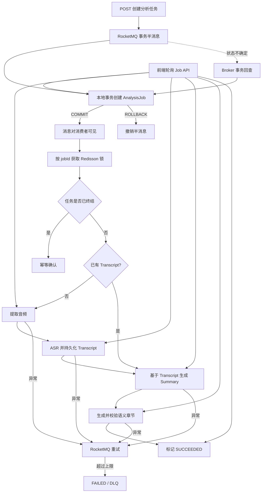

# VedioMind

面向长视频的 AI 内容理解平台。用户可以上传本地视频，或粘贴 Bilibili/YouTube 公共视频链接；系统复用本地 ASR 或平台字幕完成内容总结、章节生成和带引用问答，并在前端展示可恢复的任务进度。

> 当前重点是项目演示与异步架构闭环。完整鉴权、用量限制和第三方平台长期治理仍在 Roadmap 中，不建议直接部署到公网。

## 核心能力

- 本地视频上传到 MinIO；Bilibili/YouTube URL 只读取平台字幕，不下载完整视频。
- 视频内容工作台集成原生播放器、自动章节导航、时间戳字幕联动、AI 总结、字幕搜索、复制、导出和带原文引用的持久化多轮问答。
- MinIO Bucket 保持私有，数据库只保存对象 Key，播放使用短时效预签名 URL。
- FFmpeg 提取 16kHz 单声道 PCM，阿里云 Paraformer 输出句子级时间戳，DeepSeek 基于 Transcript 生成总结和语义章节。
- RocketMQ 事务消息保证“任务落库”和“消息投递”不会只成功一边。
- 独立 `AnalysisJob` 状态机记录阶段、进度、重试次数和失败原因。
- 消费失败由 RocketMQ 重试；达到上限后标记 `FAILED` 并进入死信流程。
- Redisson Job 锁与数据库终态检查共同处理重复投递和并发消费。
- 时间戳 Transcript Segment 在 ASR 完成后立即持久化，重试不会重复执行已经成功的昂贵阶段。
- URL 导入采用平台白名单、规范化地址和受限重定向；Bilibili 使用专用元数据/字幕 API，YouTube 由 yt-dlp 只解析元数据和字幕地址。
- 章节生成只返回 Transcript Segment ID，后端校验锚点并派生章节时间；已保存章节在任务重试时直接复用。
- 前端按媒体查询活动 Job，页面刷新后仍可恢复当前任务。
- Flyway 管理数据库结构，新环境无需手工建表。

## 视频内容工作台

上传本地视频或解析网络链接后，前端会进入 `/media/{mediaId}`：

- 本地上传通过 MinIO 预签名 URL 直接播放，支持 Range 请求与时间跳转。
- URL 来源展示平台封面与原视频入口；V1 不下载或站内播放第三方视频，时间引用仍可用于定位内容证据。
- 工作台按媒体恢复正在执行的分析任务，不依赖浏览器保存 `jobId`。
- AI 总结使用 Marked 渲染，并通过 DOMPurify 清理不可信 HTML。
- 章节导航随播放进度高亮，点击章节可跳转到对应位置。
- 字幕支持随播放高亮、点击跳转、搜索、复制，以及带时间码的 TXT/Markdown 导出。
- 视频问答按媒体持久化会话、消息与引用快照，支持会话切换和刷新恢复；每次追问携带最近 6 轮对话帮助理解指代，但事实依据始终只来自当前视频的完整字幕。
- 模型只返回 Segment ID，后端校验后再回填原文和时间戳；引用以快照保存，点击可以跳转播放。
- 当前保证浏览器兼容视频的直接播放；其他 FFmpeg 可处理的格式仍可分析，并显示明确的播放失败状态。

## 异步分析链路



任务状态流转：

```text
QUEUED
  → EXTRACTING_AUDIO
  → TRANSCRIBING
  → SUMMARIZING
  → GENERATING_CHAPTERS
  → SUCCEEDED

任一处理阶段异常 → RETRYING → 下一次消费
超过重试上限     → FAILED
```

这里选择 RocketMQ 事务消息而不是额外引入 Outbox：项目已经依赖 RocketMQ，事务消息能够以更少的组件完成当前所需的“本地任务记录 + MQ 投递”一致性。消费者侧的幂等、状态恢复和重试仍由 `AnalysisJob`、Redisson 与 RocketMQ 共同完成。

## 技术栈

| 层次 | 技术 |
| --- | --- |
| 前端 | Vue 3、Vue Router、Axios、Vite、Marked、DOMPurify |
| 后端 | Java 21、Spring Boot 3、MyBatis-Plus、Undertow |
| 异步任务 | RocketMQ 4.9.4、Redisson |
| 数据 | MySQL 8、Redis、Flyway |
| 对象存储 | MinIO |
| 媒体处理 | FFmpeg、yt-dlp |
| AI | 阿里云 Paraformer ASR、DeepSeek |

## 主要接口

| 方法 | 路径 | 用途 |
| --- | --- | --- |
| `POST` | `/media/upload` | 上传本地视频 |
| `POST` | `/media/import-url` | 通过 Bilibili/YouTube 平台字幕导入内容 |
| `GET` | `/media` | 查询当前用户的轻量媒体列表 |
| `GET` | `/media/{mediaId}` | 查询媒体详情与预签名播放地址 |
| `GET` | `/media/{mediaId}/transcript` | 查询句子级时间戳字幕 |
| `GET` | `/media/{mediaId}/chapters` | 查询自动生成的语义章节 |
| `GET` | `/media/{mediaId}/conversations` | 查询媒体的问答会话 |
| `POST` | `/media/{mediaId}/conversations` | 创建问答会话 |
| `GET` | `/conversations/{conversationId}/messages` | 查询会话消息及引用快照 |
| `POST` | `/conversations/{conversationId}/messages` | 基于字幕进行带上下文的追问 |
| `DELETE` | `/media/{mediaId}` | 删除媒体与 MinIO 对象 |
| `POST` | `/analysis/media/{mediaId}` | 创建或返回该媒体正在执行的分析任务 |
| `GET` | `/analysis/media/{mediaId}/active-job` | 查询媒体当前活动任务 |
| `GET` | `/analysis/jobs/{jobId}` | 查询任务状态与进度 |

分析任务提交成功返回 HTTP `202 Accepted`，响应示例：

```json
{
  "id": "84473eac-7f71-4307-a11c-d3ebd7654cef",
  "mediaId": 42,
  "status": "QUEUED",
  "progress": 0,
  "retryCount": 0,
  "errorMessage": null,
  "createdAt": "2026-09-28T14:30:00",
  "startedAt": null,
  "finishedAt": null
}
```

RocketMQ 无法接收任务时，接口返回 HTTP `503 Service Unavailable` 和错误码 `ROCKETMQ_UNAVAILABLE`；前端会提示确认 NameServer 与 Broker 已启动后重试。

## 本地运行

### 1. 环境要求

- JDK 21
- Node.js 22（Vite 最低要求为 20.19）
- Docker 与 Docker Compose
- FFmpeg
- yt-dlp

### 2. 启动中间件

```bash
docker compose up -d
```

默认会启动 MySQL、Redis、MinIO、RocketMQ NameServer、Broker 和 Dashboard。端口见 [docker-compose.yml](docker-compose.yml)。

演示前可确认 RocketMQ 两个核心容器均为 `Up`：

```bash
docker compose ps rmqnamesrv rmqbroker
```

### 3. 配置后端

```bash
cp server/src/main/resources/application.example.properties \
   server/src/main/resources/application.properties

export DEEPSEEK_API_KEY=your_deepseek_key
export ALIYUN_API_KEY=your_aliyun_key
export FFMPEG_DIR=/path/to/ffmpeg/bin
export YTDLP_PATH=/path/to/yt-dlp
```

数据库连接、MinIO、Redis 和 RocketMQ 均提供了适配本仓库 Docker Compose 的默认值。真实密钥只应放在环境变量或被 Git 忽略的本地配置中。

### 4. 启动后端

```bash
cd server
./mvnw spring-boot:run
```

后端默认监听 `http://localhost:9090`。首次启动时 Flyway 会创建所需表；对于已有但尚未由 Flyway 管理的数据库，会从基线版本 `0` 接管。

### 5. 启动前端

```bash
cd client
npm install
npm run dev
```

前端默认访问 `http://localhost:5173`。

## 验证

```bash
cd server
./mvnw test

cd ../client
npm run build
```

当前 31 个后端测试覆盖事务消息提交/回查、RocketMQ 不可用错误映射、消费重试与失败终态、对象上传补偿、预签名播放地址、阿里云时间戳响应解析、Bilibili/YouTube 字幕解析、URL 白名单与重定向复检、问答引用校验、多轮上下文编排、章节锚点校验，以及“复用已保存 Segment、Summary 和 Chapter”的分析主流程。

## Roadmap

- Spring Security、密码哈希、资源所有权校验与统一错误响应。
- MinIO Multipart 直传、断点续传和真实上传进度。
- 无平台字幕时的音频 ASR 回退，以及登录、地区限制等第三方平台能力治理。
- 章节人工编辑、合并拆分和播放器进度条标记。
- 长视频检索/RAG，以及 OCR、关键帧和多模态理解。
- 任务错误码、模型/Prompt 版本、耗时、Token 与成本统计。
